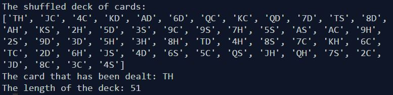

# Python Programming
The course covers programming fundamentals using the Python language to write programs that perform various tasks including manipulating numerical and textual information; accessing content in files; transferring information to and from web sites. Topics include writing object-oriented programs using classes and objects, describing the Python operators for manipulating lists, dictionaries, tuples and files, and creating useful stand-alone and CGI applications. 

- [x] [Project 1: Cards- Shuffle and deal a card](https://github.com/Sally-Ng/Python-Cards)
- [x] [Project 2: Building Numbers- Who workings in which building?](https://github.com/Sally-Ng/Python-Building_Numbers/blob/master/README.md)

####  [Project 1: Cards- Shuffle and deal a card](https://github.com/Sally-Ng/Python-Cards)
The program will create a deck of cards, shuffle it and deal a card. 
 

  

####  [Project 2: Building Numbers- Who workings in which building?](https://github.com/Sally-Ng/Python-Building_Numbers/blob/master/README.md)
The program will keeps track of which workers work in what buildings. The information will be stored in a dictionary while the program is running and kept in a file when the program is not running. 
 

  

